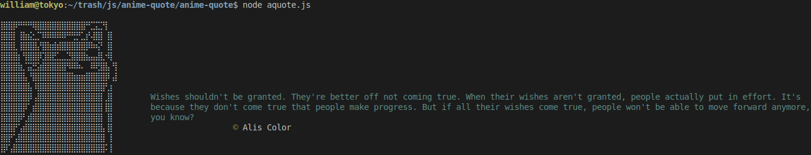

# aquote - funny ASCII cat with a random anime quote

# installation

`git clone git@github.com:webPrsnr/anime-quote.git`
`npm i`

# usage

`node aquote.js`

## used api

- [Anime Chan API](https://github.com/rocktimsaikia/anime-chan)
